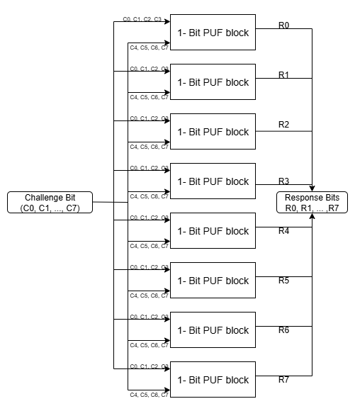
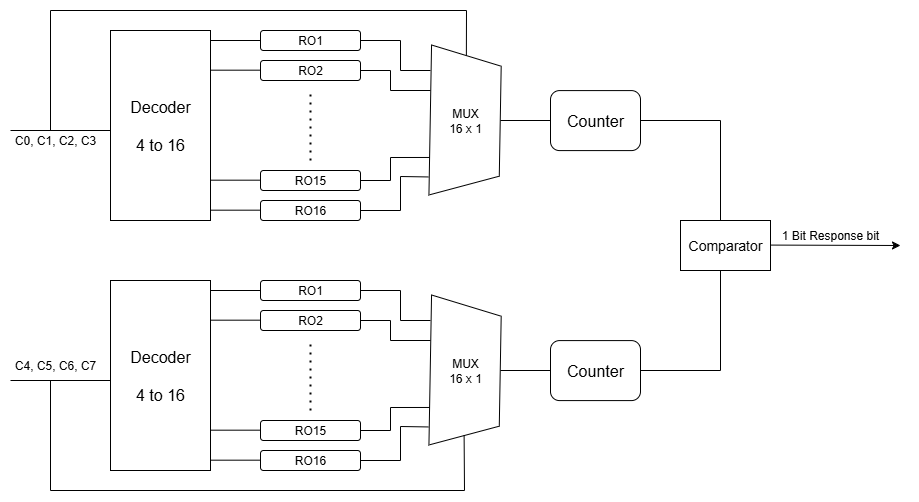
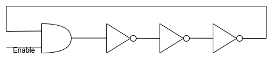

# Ring Oscillator Based PUF

- What are PUF?
PUF stands for Physically Unclonable Functions. They are used as the "fingerprints" of electronics devices, to ensure there is no tempering done in any componenet of the circuit.

- Here, we will focus on a type of PUF called the Ring Oscillator PUF. It uses a ring Oscillator (chain of inverter gates) at its core principle.

- We will cover the basic design of a Ring Oscillator PUF as well as cover an improved design called the "Configurable Ring Oscillator" which is better in terms of power, compared to the normal RO-PUF

### How dos a Ring-oscillator Based PUF work?
- Each inverter gate will have its own, unique delay which is produced during its manufacturing, placemnent of the gate on the chip and other factors.
- Thus, a Ring Oscllator, made by odd numbers of Inverter Gates will also have a unique frequency of Oscillation (which is due to the differnet delays that each inverter has, due to its manufacturing).
- We use this fact and compare the frequency of 2 Ring Oscillator (say A and B) and generate a response bit (r[0])
- r[0] = 0 if frea(A) > frea(B)
- r[0] = 1 if freq(A) < freq(B)

# Configurable Ring Oscillator PUF

- Configurable Ring Osillator based PUF's are currently being explored and studied as an better alternative to the standard PUF's. The main advantage is that we can re-configure the oscillation path and create new oscillation paths with the same set of inverter gates.

- The design of the CRO is as follows:-

- Here, based on the selection bits (c1, c2, c3) we can choose the oscillation path.

- The design used to generate 1 bit PUF using CRO is as follows:-

